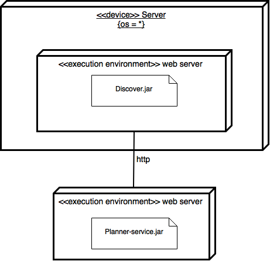

SeaClouds Discoverer
====================

The SeaClouds Discoverer module is able to provide information about cloud offerings through its RESTful API.
Those information are a TOSCA YAML representation (following the [SeaClouds Discovery design and orchestration functionalities](http://www.seaclouds-project.eu/deliverables/SEACLOUDS-D3.2%20Discovery_design_and_orchestration_functionalities.pdf) specification) of the offerings retrieved by the crawlers from [CloudHarmony](https://cloudharmony.com) and [PaaSify](http://www.paasify.it).

# Installing and running SeaClouds Discoverer
The easiest way to install and run this component is explained in SeaClouds [README.md](../README.md).

## Requirements
Running SeaClouds Discoverer only requires Java 7 (or greater) installed on the target machine. Among with the software requirements, it also needs:

- A discovererconf.yml configuration file
- A running MongoDB service, used as a permanent layer to store information about cloud offerings used by SeaCloudsPlatform

### Config.yml configuration file
SeaClouds Discoverer is packaged as a Dropwizard application. It requires a configuration file to run. SeaClouds already has an example [discovererconf.yml](./discovererconf.yml)
file. The configuration parameters are:

- discoverer port (1236 by default)
- activeCrawlers is the list of crawlers to use (currently we only support "CloudHarmonyCrawler" and "PaasifyCrawler")
- databaseURL is the URL of the MongoDB that will be used to store offerings
- databasePort

All the configuration variables are required.

## Starting the SeaClouds Discoverer
Once you have fulfilled the requirements you only need to run on JRE (>=1.7):

``` java -jar discoverer.jar server path/to/config.yml ```

# Deployment diagram for discoverer


# Building SeaClouds Discoverer
If you want to build SeaClouds Discoverer please follow the instructions on SeaClouds [README.md](../README.md).

#License##
Licensed under the [Apache License, Version 2.0](http://www.apache.org/licenses/LICENSE-2.0).