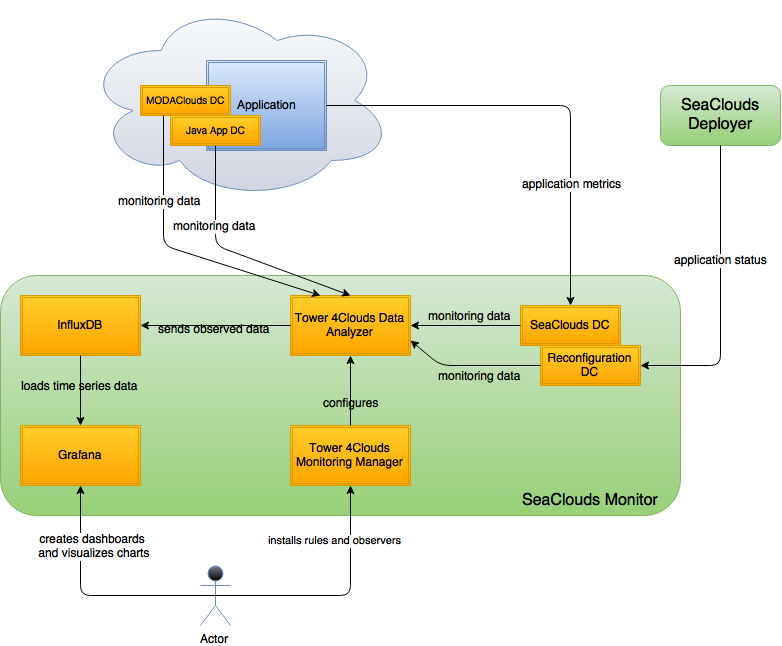

SeaClouds Monitor
==================

The SeaClouds monitor module is responsible, as its name suggests, to monitor SeaClouds applications at runtime. To this aim we mainly rely on [Tower4Clouds](https://github.com/deib-polimi/tower4clouds/) a monitoring platform for multi-clouds application developed in the context of the [MODAClouds](http://www.modaclouds.eu) FP7 European Project. The released platform has been extended and customized in order satisfy specific SeaClouds monitoring requirements. More specifically, since Tower4Clouds relies on the concept of Data Collector (DC), or the components responsible to collect monitoring metrics, as main the mechanism to extend the Platform, a number of new Tower4Clouds's Data Collectors has been developed in SeaCloud. Moreover, being Tower4Clouds already integrated with some suitable external tools enabling visualization of monitoring data, like InfluxDB and Graphite, we decided to exploit this integration as a way to provide application metrics visualization in SeaClouds.
Overall the SeaClouds Monitor architecture is depicted in the following figure:

Let's briefly introduce the role of each of the represented components:

- Tower 4Clouds Monitoring Manager: the main coordinator of the platform. It is responsible of configuring the Data Analyzer and Data Collectors based on user inputs. The human user can interact with the manager through the Webapp. Non-human users can interact using the exposed REST API. 

- Tower 4Clouds Data Analyzer: the main engine of the platform. It is responsible for processing incoming data, forwarding to external observes and executing queries over the incoming data stream.

- InfluxDB: a time series, metrics, and analytics database.

- Grafana: it provides a powerful and elegant way to create, explore, and share dashboards and data. Grafana is most commonly used for visualizing time series data for Internet infrastructure and application analytics. It also provides full InfluxDB support along with many other supported data sources.

- MODAClouds Data Collector: developed in the context of the MODAClouds porject, this data collector is able to provide a couple of metrics at both infrastructural and application level. 

- Java App Data Collector: this data collector provides application level metrics, like the application response time or throughput, for Java application. It can be imported as a library and properly configured in the application itself.

- SeaClouds Data Collector: one of the Data Collectors developed in the context of SeaClouds whose main goal is to supply application level metrics not provided by any of the existing Data Collectors

- Reconfiguration Data Collector: one of the Data Collectors developed in the context of SeaClouds whose main goal is to support the SeaClouds replanning process by providing replanning related metrics, in example the application status. It interact with the SeaClouds Deployer in order to collect the provided monitoring metrics.

All the components in the SeaClouds Monitor green box are part of the SeaClouds Platform included the Reconfiguration and SeaClouds Data Collectors. Then each application deployed using SeaClouds will be equipped, according to the application and deployment characteristics, with additional required Data Collectors. 

##How to install the entire platform

In the following we are going to provide instructions on how to install each component belonging to the SeaClouds Monitor module starting from a fresh installation of Ubuntu 14.04. The SeaClouds Monitor components installation order should be the one suggested by the following steps.

###Tower 4Clouds Monitoring Manager and Data Analyzer

**Requirements**

SeaClouds currently use Tower 4Clouds version 0.2.3. In order to work Tower 4Clouds needs Java 7 installed. On ubuntu 14.04 you can run:

    sudo apt-get update
    sudo apt-get install openjdk7-jre

**Download**

In order to download Tower 4Clouds Data Analyzer v0.2.3 and Tower 4Clouds Monitor Manager v.0.2.3 you can run the follwing command:

    wget https://github.com/deib-polimi/tower4clouds/releases/download/v0.2.3/data-analyzer-0.2.3.tar.gz
    wget https://github.com/deib-polimi/tower4clouds/releases/download/v0.2.3/manager-server-0.2.3.tar.gz

**Configuraton**

The only required configuration is that the Data Analyzer need to know the public IP of the Monitor Manager. In order to do that you can export the following environmental variable:

    export MODACLOUDS_TOWER4CLOUDS_DATA_ANALYZER_ENDPOINT_IP_PUBLIC=<MONITOR-MANAGER-PUBLIC-PORT>

After that, you need to untar the downlaoded files and start the the two services using their own starter scripts. You could use the following script:

    tar -xvzf data-analyzer-0.2.3.tar.gz
    tar -xvzf manager-server-0.2.3.tar.gz
    cd data-analyzer-0.2.3
    rm -f tower4clouds-data-analyzer.log
    nohup bash tower4clouds-data-analyzer > tower4clouds-data-analyzer.log 2>&1 &
    cd ..
    cd manager-server-0.2.3
    rm -f tower4clouds-manager.log
    nohup bash tower4clouds-manager > tower4clouds-manager.log 2>&1 &

After that you can check that the platform is up and running by connecting to http://<MONITOR-MANAGER-HOST-IP>:8170/webapp to see the Monitor Manager web console.

Finally, according with the current status of Tower 4Clouds, it is necessary to install an initial static monitoring rule enabling the monitoring of the response time for application modules. You can use the following curl in order to do that, properly replacing the Monitoring Mnagaer endpoint information (IP and port):

    curl -X POST -H "Content-type: application/xml" http://${MONITOR_MANAGER_HOST}:${MONITOR_MANAGER_PORT}/v1/monitoring-rules -d '
    <ns2:monitoringRules>
        <ns2:monitoringRule id="internalComponentRTRule" timeStep="2" timeWindow="2">
            <ns2:monitoredTargets>
                <ns2:monitoredTarget class="Method"/>
            </ns2:monitoredTargets>
            <ns2:collectedMetric metricName="EffectiveResponseTime">
                <ns2:parameter name="samplingProbability">1</ns2:parameter>
            </ns2:collectedMetric>
            <ns2:metricAggregation groupingClass="InternalComponent" aggregateFunction="Average"/>
            <ns2:actions>
                <ns2:action name="OutputMetric">
                    <ns2:parameter name="metric">AverageResponseTimeInternalComponent</ns2:parameter>
                    <ns2:parameter name="value">METRIC</ns2:parameter>
                    <ns2:parameter name="resourceId">ID</ns2:parameter>
                </ns2:action>
            </ns2:actions>
        </ns2:monitoringRule>
    </ns2:monitoringRules>
    '    

###InfluxDB

**Requirements**

As reported on the documentation (https://influxdb.com/docs/v0.8/introduction/installation.html):

"By default InfluxDB will use ports 8083, 8086, 8090, and 8099. Once you install you can change those ports and other options in the configuration file, which is located at either /opt/influxdb/shared/config.toml or /usr/local/etc/influxdb.conf"

**Download & Install**

Tower 4Clouds comes integrated with InfluxDB version 0.8. In order to install InfluxDB one can refer to the InfluxDB installation documentation available at the following [link](https://influxdb.com/docs/v0.8/introduction/installation.html#ubuntu-debian).

In particular it is sufficient to run the following commands to download and install InfluxDB:

    #for 64-bit systems
    wget http://get.influxdb.org.s3.amazonaws.com/influxdb_0.8.9_amd64.deb
    sudo dpkg -i influxdb_0.8.9_amd64.deb

**Start**

In order to start InfluxDB just run the following:

    sudo service influxdb start

To check that InfluxDB is up and running just connect to http://<INFLUXDB-HOST-IP>:8083/ to see the InfluxDB console.

###Grafana

**Download & Install**
 
In order to install Grafana on Ubuntu you can refer to its own documentation available at the following [link](http://docs.grafana.org/installation/debian/). 

In particular in order to download and install Grafana the following commands need to be executed:

    wget https://grafanarel.s3.amazonaws.com/builds/grafana_2.5.0_amd64.deb
    sudo apt-get install -y adduser libfontconfig
    sudo dpkg -i grafana_2.5.0_amd64.deb

**Start**

In order to start Grafana just run the following:

     sudo service grafana-server start

To check that Grafana is up and running just connect to http://<GRAFANA-HOST-IP>:3000/ to see the Grafana console.

**Latch with InfluxDB**

In order to configure Grafana to consider InfluxDB as the default data source to use, assuming that you have previously installed InfluxDB on the same host, you can use the following command:

    curl -H "Content-Type: application/json" -X POST -d '{"name": "InfluxDB", "url": "http://localhost:8086/", "type": "influxdb", "database": "tower4clouds", "user": "nouser", "password": "nopassword", "access": "proxy", "isDefault": true}' http://admin:admin@<GRAFANA-HOST-IP>:3000/api/datasources

###SeaClouds Data Collector

For instructions on how to install and run the SeaClouds Data Collector you can refer to its own [documentation](https://github.com/SeaCloudsEU/SeaCloudsPlatform/tree/master/monitor/nuro-data-collector).

###Reconfiguration Data Collector

For instructions on how to install and run the Recofniguration Data Collector you can refer to its own [documentation](https://github.com/SeaCloudsEU/SeaCloudsPlatform/tree/master/monitor/reconfiguration-data-collector).
